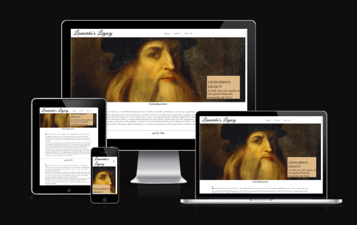
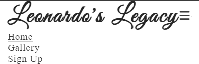
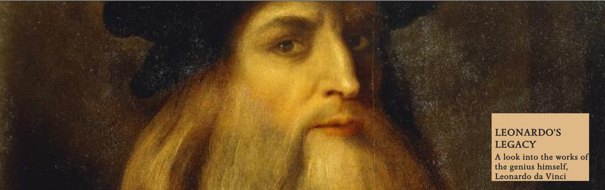
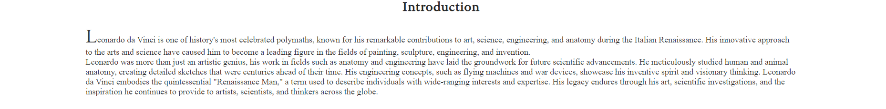
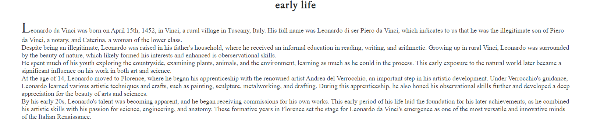
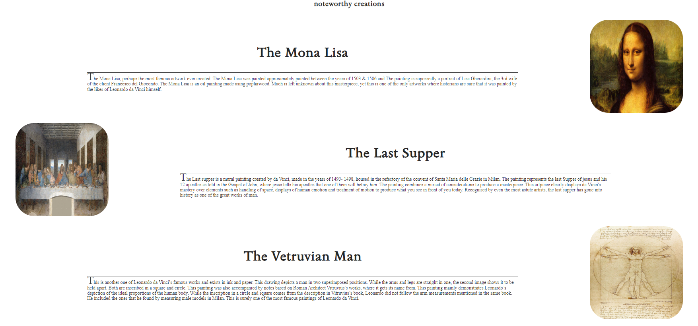
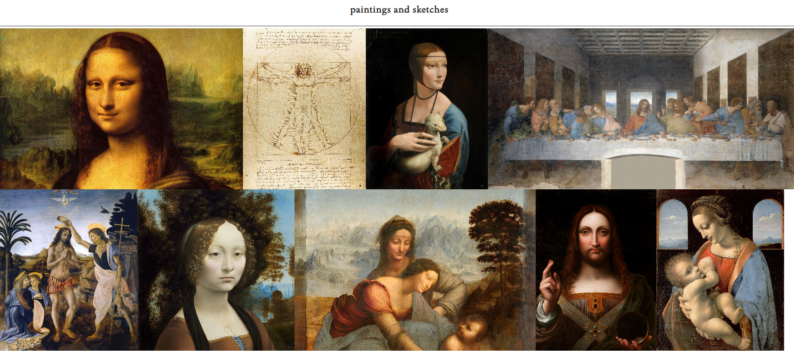
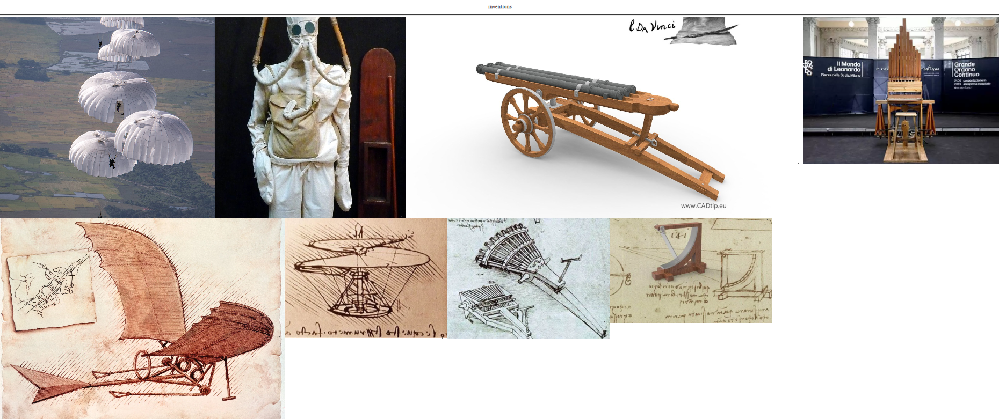
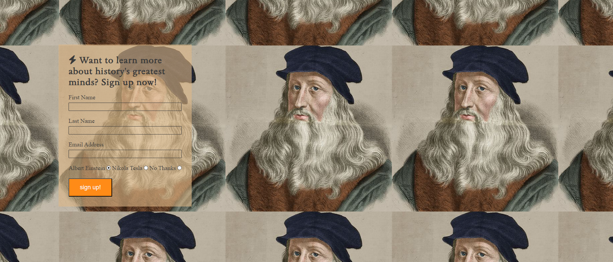
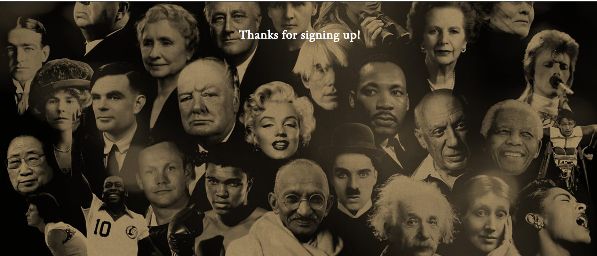

# Leonardo's Legacy

Leonardo's Legacy is a biography website to designed commemorate the life and works of Leonardo da Vinci. 

The website mainly targets users who are already aware of who da Vinci is and want to learn more about him.

The goal of Leonardo's Legacy is to inform, impress and inspire the user by showing off various paintings and inventionsmade by Leonardo da Vinci. T
he site also provides some basic knowledge about who da Vinci is and what his early years looked like.

The website also contains a form in which users can submit their email to be redirected to other websites where they can learnabout the legacy of other great people.

 Links to our socials media is included in the footer of the page.

[View Leonardo's Legacy project here](https://rasm1.github.io/Leonardo-s-Legacy/index.html)

## features

<ul>   
	<li>This website targets people who want to learn more about Leonardo da Vinci.</li>
	<li>This can be done by reading the information provided on the homepage and browsing through the gallery.</li>
	 <li>If users want to learn more about other great people they can navigate to the signup form through the navigation bar in the header
	 to sign up for more information about other great people. </li>
	 <li>Responsive on all device sizes.</li>
</ul>

### Existing Features

#### Navigation Bar
<ul>   
	<li>It is featured and fixed on all three pages and on the thank-you page (seen once the form has been filled in)</li>
	<li>Includes links to the logo, home page, gallery and sign up page and is identical in each page to allow for easy navigation.</li>
	<li>This header will allow the user to easily navigate from page to page across all devices without having to use the 'back button' to go to the previous page.</li>
	<li>To optimize screen usage, on smaller screens the navigation bar collapses into a dropdown menu which can be clicked to navigate to the other pages.</li>	
</ul>

#### Landing Page Image  
<ul>
		<li>The landing page includes a portrait with text overlay to allow the user to immediatly and clearly see
		what this website is about and what they can expect.</li>
 </ul>

#### Introduction Section
<ul>
		<li>This section is meant to introduce da Vinci and tell the users about what who he is, what he is known for. And what makes him so special</li>
		<li>This section is valueable because it introduces the user to the person who the biography is about. Furthermore it gets the user interested in actually learning more about him.</li>
</ul>

#### Early Life Section
<ul>
		<li>This section is meant to inform the user about the early life of leonardo da vinci. </li>
		<li>The user learns about the birthplace of da Vinci and what his formative years looked like. </li>
        <li>The user also learns what competencies da Vinci posessed from his ealy life which aided him greatly in defining who he would later become</li>
</ul>

#### Noteworthy Creations Section
<ul>
	<li>In this section the user will learn what da Vinci's most famous creations were. </li>
    <li>The user will learn more about what these creations entailed and how they were made.</li>
</ul>		

#### Footer
<ul>
		<li>The footer section includes links to the relevant social media sites for Leonardo's Legacy. These links will open in a new tab to allow fgor easy navigation for the user</li>
		<li>The footer is valuable to the user because it provides a way for the user to stay connected via social media.</li>
</ul>	

#### Gallery
<ul>
		<li>The gallery will provide the user with supporting images to see more of the creations da Vinci has made.</li>
		<li>This section is valuable to the user as it easily showcases the creations da vinci has made.</li>
</ul>

#### Sign Up page
<ul>
		<li>This page will allow the user to get signed up for additional information about great people's legacies.</li>
		<li>The user will be able to specify what person they are interested in or if they are interested at all. The user will be asked to submit
		their full name and email address.</li>
</ul>

#### Thank You Page
<ul>
		-This page is valuable to the user because it confirms to the user that they have been signed up.
</ul>		

### Features Left to Implement
	-additional images added to the gallery with explenation about what the image is.
	-another section about da Vinci's last years alive.
	-In the thank you page, there could be a clickable link that would redirect the user to a legacy page about a
	diffrent great person (example: Albert Einstein)
		

## User Experience (UX)

This website is meant to attract people who are interested in the life and works of Leonardo da Vinci and want to learn more about him.
The information is structured in such a way that it can be clearly understood and followed.

	## User Stories
		-First-time visitor goals:
			-Understand the main purpose of the site and to learn more about Leonardo da Vinci and his creations
			-Easily navigate through the site to find what the user is looking for.
			-Find the signup form and fill it out.

		-Returning visitor goals:
			- Find out more information about da Vinci.
			-Review the site's gallery
			-To be redirected to sites about other great people

		-frequent user Goals:
			-To be redirected to sites about other great people
			-Review the gallery for new photos
			-Find out more information about da Vinci.

Design:
	-Color Scheme
		-Primary colors used on the website:
			(Picture of primary hexcolors)
	-typography
		-Primary fonts used in the website with sans-serif as fallback font incase the prefered font will not import.

Technologies Used:
	-HTML5
	-CSS3
	-(chatgpt for text?)

Frameworks, libraries & programs used:
	-gitpod
	-to write the code
	-git
	-for version controll
	-github
	-deployment of website and stories files online
	-google fonts
	-import main font of the website
	-font-awesome
	-import (fav)icons to the website
	-chatgpt
	-to generate well structured content in the homepage
	-amiresponsive
	Mockup picture for the README file

Testing:
-I have confrmed that the site is responsive, looks good and functions on all standard screen sized using the dev tools toolbar.
-I have confirmed that all text on the website is readable and easy to understand.
-I have confirmed taht the signup form works, all fields have to be filled in with the appropriate content for the submission to work.

-I have confired that all images load properly.
-I have tested the site on the following web browsers: Opera GX, Microsoft Edge, Google Chrome.
The site works on all of these browsers accordingly.

## Validation results
The W3c Markup Validator and W3C CSS validator services were used to validate every page of the projec to ensure there were no errors to be found.
	
	

HTML -  no errors were returned when passing the site through the official [The W3C HTML validator](https://validator.w3.org) 

CSS - No errors were returned when passing the site through the official [The W3C CSS validator (jigsaw)](https://jigsaw.w3.org/css-validator/)

Accesability
	
	-
	

